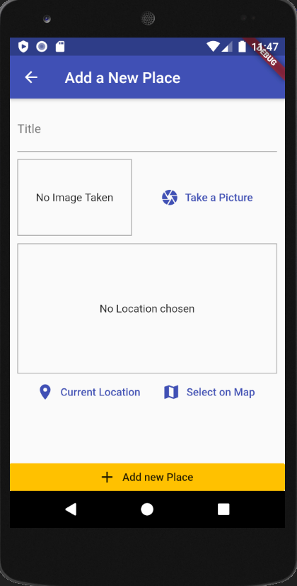

# Places FlutterApp
This is a testing dummy application on how to access native device features in flutter. In this application you can save images on new places and also you can point to the location of that specific place in maps.
 This application helped me to understand on,
 - How to use native device features from flutter
 - How to use sql-lite database in flutter
 - Managing a simple database through flutter
 - How to store images in the local storage
 Below you can see two previews in this application.
 
  
  

## Flutter Packages for this app

 1. sqflite 
 2. image_picker
 3. provider
 4. location
 5. path_provider
